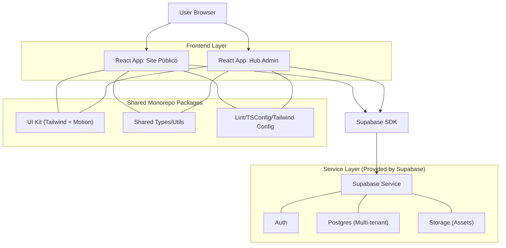

## 1.Architecture design


Estratégia de multi-tenant: isolamento por **tenant_id** em todas as entidades relevantes e políticas RLS; resolução de tenant no site via hostname/path e carregamento de tema+conteúdo publicados.

## 2.Technology Description
- Frontend: Vite + React@18 + TypeScript + tailwindcss@3 + framer-motion@10
- Roteamento: React Router (site e admin)
- Backend: Supabase (Auth + Database + Storage) via @supabase/supabase-js no frontend

## 3.Route definitions
| Route | Purpose |
|-------|---------|
| / | Home do tenant (site público) |
| /p/:slug | Página de conteúdo publicada (site público) |
| /admin/login | Login do hub admin |
| /admin/tenants | Seleção de tenant (lista de acessos) |
| /admin/:tenantId/dashboard | Visão geral + ações principais |
| /admin/:tenantId/branding | Configurar marca (nome/logo/cores) |
| /admin/:tenantId/pages | Lista/edição/publicação de páginas |
| /admin/:tenantId/users | Gerenciar membros e papéis |

## 4.API definitions (If it includes backend services)
Não há backend customizado; o frontend usa diretamente o Supabase SDK.

## 6.Data model(if applicable)

### 6.1 Data model definition
Entidades mínimas:
- tenants: { id, name, status, created_at }
- tenant_domains: { id, tenant_id, hostname, is_primary }
- tenant_members: { id, tenant_id, user_id, role }
- site_pages: { id, tenant_id, slug, title, seo_json, content_json, status(draft/published), published_at, updated_by }
- assets: { id, tenant_id, path, kind, metadata_json }

Regras principais:
- Todo registro “do tenant” contém tenant_id.
- tenant_members controla acesso ao hub admin e escopo de leitura/escrita.

### 6.2 Data Definition Language
```sql
-- Tenants
create table if not exists tenants (
  id uuid primary key default gen_random_uuid(),
  name text not null,
  status text not null default 'active',
  created_at timestamptz not null default now()
);

-- Associação usuário <-> tenant (papéis no hub)
create table if not exists tenant_members (
  id uuid primary key default gen_random_uuid(),
  tenant_id uuid not null,
  user_id uuid not null,
  role text not null default 'editor',
  created_at timestamptz not null default now()
);

-- Conteúdo publicado
create table if not exists site_pages (
  id uuid primary key default gen_random_uuid(),
  tenant_id uuid not null,
  slug text not null,
  title text not null,
  seo_json jsonb not null default '{}'::jsonb,
  content_json jsonb not null default '{}'::jsonb,
  status text not null default 'draft',
  published_at timestamptz,
  updated_by uuid,
  updated_at timestamptz not null default now()
);

-- Grants (guideline básico)
grant select on tenants, tenant_members, site_pages to anon;
grant all privileges on tenants, tenant_members, site_pages to authenticated;

-- Observação: habilitar RLS e aplicar policies por tenant_id e membership.
```
