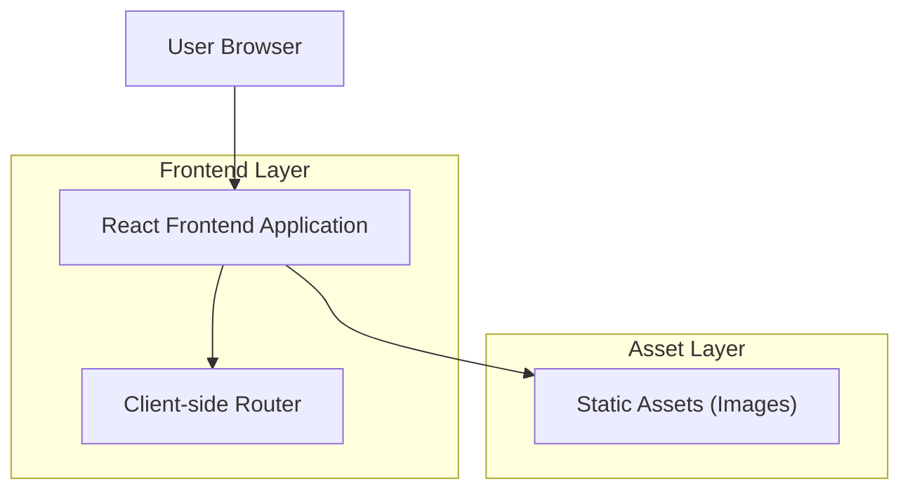

## 1.Architecture design

## 2.Technology Description
- Frontend: React@18 + react-router-dom + tailwindcss@3 + vite
- Backend: None

## 3.Route definitions
| Route | Purpose |
|-------|---------|
| / | Página inicial com menu fixo, carrossel no topo e rodapé com atalhos |
| /secao/:slug | Página individual de cada item do menu (conteúdo da seção), com o mesmo menu fixo e rodapé |
