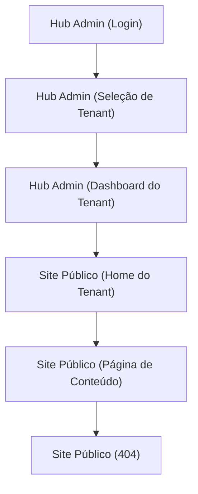

## 1. Product Overview
Monorepo white-label com dois apps: **site público por tenant** e **hub admin multi-tenant**.
Foco rígido em performance, acessibilidade (a11y) e SEO, com personalização de marca, conteúdo e domínio por tenant.

## 2. Core Features

### 2.1 User Roles
| Papel | Como entra | Permissões principais |
|------|------------|------------------------|
| Visitante (anônimo) | Acessa URL do tenant | Navegar no site público; consumir conteúdo; indexação SEO. |
| Membro do Tenant (Admin/Editor) | Login | Gerenciar conteúdo/páginas do seu tenant; configurar marca; publicar/preview. |
| Admin da Plataforma | Login (conta interna) | Criar/ativar tenants; gerenciar membros; ver status/health básico. |

### 2.2 Feature Module
O produto consiste nas seguintes páginas essenciais:
1. **Site Público (Home do Tenant)**: hero + proposta, navegação, seções configuráveis, CTAs, links institucionais.
2. **Site Público (Página de Conteúdo)**: renderização por slug (ex.: /p/:slug), SEO por página, componentes de conteúdo.
3. **Hub Admin (Login)**: autenticação e recuperação de sessão.
4. **Hub Admin (Seleção de Tenant)**: listar tenants associados e escolher contexto.
5. **Hub Admin (Dashboard do Tenant)**: branding, páginas/conteúdo, membros, preview/publicação.

### 2.3 Page Details
| Page Name | Module Name | Feature description |
|-----------|-------------|---------------------|
| Site Público (Home do Tenant) | Resolução de tenant | Detectar tenant por hostname/path; carregar tema + navegação + conteúdo inicial. |
| Site Público (Home do Tenant) | SEO + performance | Definir title/description/OG; gerar HTML semântico; carregar assets otimizados; budgets Lighthouse (perf/a11y/SEO). |
| Site Público (Home do Tenant) | Seções configuráveis | Renderizar blocos (ex.: texto, lista, cards, FAQ) conforme configuração do tenant. |
| Site Público (Página de Conteúdo) | Roteamento por slug | Buscar e renderizar página publicada pelo slug; tratar 404. |
| Site Público (Página de Conteúdo) | SEO por página | Aplicar metadados do conteúdo (title, canonical, OG, schema quando disponível). |
| Hub Admin (Login) | Autenticação | Entrar/sair; manter sessão; bloquear acesso às rotas privadas. |
| Hub Admin (Seleção de Tenant) | Contexto multi-tenant | Listar tenants do usuário; selecionar tenant; persistir seleção por sessão. |
| Hub Admin (Dashboard do Tenant) | Branding | Editar nome, logo, cores, tipografia básica; upload de assets; pré-visualizar. |
| Hub Admin (Dashboard do Tenant) | Páginas/Conteúdo | Criar/editar rascunho; publicar; definir slug; ordenar navegação; editar SEO por página. |
| Hub Admin (Dashboard do Tenant) | Membros | Convidar/remover; definir papel (Admin/Editor). |
| Hub Admin (Dashboard do Tenant) | Auditoria mínima | Registrar quem publicou e quando (histórico simples por página). |

## 3. Core Process
**Fluxo do Visitante (site público):**
1) Acessa o domínio/URL do tenant → 2) Vê a Home com marca e conteúdo → 3) Abre uma página por slug → 4) Se slug inválido, vê 404.

**Fluxo do Membro do Tenant (Admin/Editor):**
1) Faz login → 2) Seleciona tenant → 3) Ajusta branding → 4) Cria/edita páginas (rascunho) → 5) Preview → 6) Publica → 7) Confere no site público.

**Fluxo do Admin da Plataforma:**
1) Faz login → 2) Cria/ativa tenant → 3) Define membros iniciais → 4) Acompanha status básico.

