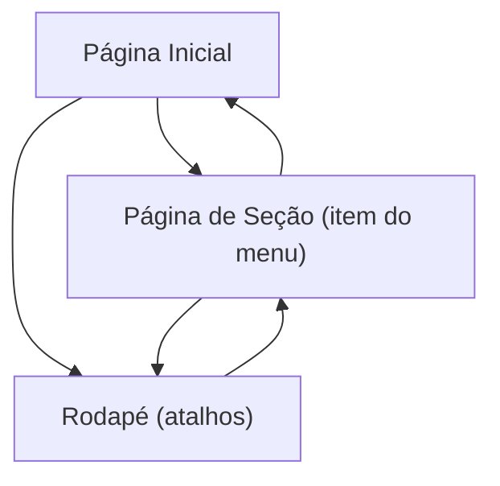

## 1. Product Overview
Site público responsivo com menu superior fixo, carrossel de imagens no topo, páginas individuais para cada item do menu e rodapé com atalhos para as mesmas páginas.
Foco em navegação simples e consistente entre desktop e mobile.

## 2. Core Features

### 2.1 Feature Module
Nosso site requer as seguintes páginas principais:
1. **Página Inicial**: menu superior fixo, carrossel de imagens no topo, acesso aos itens do menu, rodapé com atalhos.
2. **Página de Seção (uma por item do menu)**: conteúdo da seção, menu superior fixo, rodapé com atalhos.

### 2.3 Page Details
| Page Name | Module Name | Feature description |
|-----------|-------------|---------------------|
| Página Inicial | Menu superior fixo | Exibir navegação fixa no topo com links para cada item do menu; manter item ativo/realce conforme página atual; adaptar para mobile (ex.: botão de menu/colapso). |
| Página Inicial | Carrossel no topo | Exibir carrossel de imagens no topo; permitir trocar slides; manter proporção e recorte adequados em diferentes larguras. |
| Página Inicial | Conteúdo principal | Exibir conteúdo abaixo do carrossel (ex.: texto/blocos) sem prejudicar a navegação; garantir espaçamento para não ficar sob o menu fixo. |
| Página Inicial | Rodapé com atalhos | Exibir rodapé com links/atalhos para as mesmas páginas do menu; manter layout responsivo (colunas/linhas). |
| Página de Seção (item do menu) | Cabeçalho da página | Exibir título/identificação da seção; manter hierarquia visual clara. |
| Página de Seção (item do menu) | Conteúdo da seção | Exibir o conteúdo específico da seção; suportar rolagem; manter legibilidade em desktop e mobile. |
| Página de Seção (item do menu) | Menu superior fixo | Reutilizar o mesmo menu fixo para navegação consistente entre seções. |
| Página de Seção (item do menu) | Rodapé com atalhos | Reutilizar o rodapé com links/atalhos para as mesmas páginas do menu. |
| Todas as páginas | Responsividade | Ajustar tipografia, espaçamento e distribuição (menu/rodapé/carrossel) para diferentes larguras; garantir usabilidade por toque no mobile. |

## 3. Core Process
Fluxo principal do usuário:
1. Você entra na Página Inicial e vê o menu superior fixo e o carrossel no topo.
2. Você seleciona um item no menu superior (ou no rodapé) para abrir a página correspondente.
3. Você navega entre páginas individuais usando o menu superior fixo ou os atalhos do rodapé.

